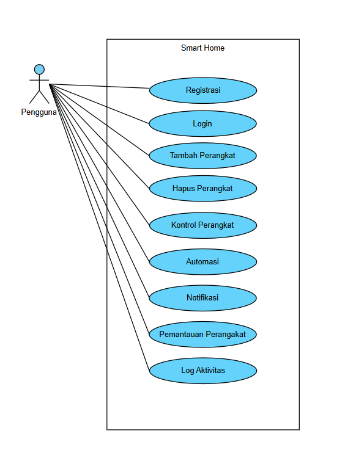

# **Tugas-KPPL-Week-13**

Kelompok 13:

1.  Adyuta Prajahita Murdianto - 5025221186

2.  Mirza Zaki Rafii - 5025221018

## **Problems**

1. Berdasarkan SRS dan Use Case Smart Home pada minggu lalu buatlah Analysis Modelnya.
2. Analysis Model, Use Case Diagram, Activity Diagram, dan Class Diagram.
3. Lengkapi Analysis Model yang dibuat dengan Behavioral Element.
4. Pengerjaan bisa secara kelompok, maksimal 2

## **Use Case Diagram**

