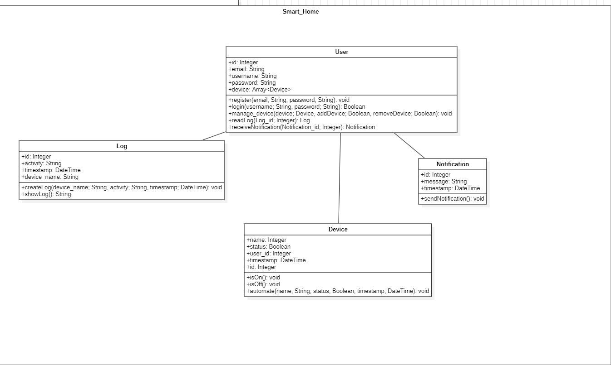

# **Tugas-KPPL-Week-13**

Kelompok 13:

1.  Adyuta Prajahita Murdianto - 5025221186

2.  Mirza Zaki Rafii - 5025221018

## **Problems**

1. Berdasarkan SRS dan Use Case Smart Home pada minggu lalu buatlah Analysis Modelnya.
2. Analysis Model, Use Case Diagram, Activity Diagram, dan Class Diagram.
3. Lengkapi Analysis Model yang dibuat dengan Behavioral Element.
4. Pengerjaan bisa secara kelompok, maksimal 2

## **Class Diagram**

## **Use Case Diagram**

## **Activity Diagram**

- Register

    

- Login

    

- Add Device

    

- Remove Device

    

- Device Status

    

- Control and Automation

    

- Log

    

## **Analisis Class Diagram**

 ### **User** ###

 **Atribut**

- id

   Pengidentifikasi unik untuk setiap pengguna. Memastikan identifikasi yang jelas dari setiap individu dalam sistem.

- email
   Digunakan untuk komunikasi dan notifikasi, juga berfungsi sebagai pengidentifikasi saat pendaftaran dan masuk.

- username

   Menyediakan nama pengguna yang ramah untuk login dan tampilan.

- password

   Kredensial aman untuk autentikasi pengguna.

- device

   Array yang menyimpan semua perangkat yang dikelola oleh pengguna. Ini memungkinkan sistem mengelola beberapa perangkat per pengguna.

**Metode**

- register(email: String, password: String): void

  Memungkinkan pengguna baru membuat akun dengan menyediakan kredensial yang diperlukan.

- login(username: String, password: String): Boolean 

  Mengautentikasi pengguna dengan memverifikasi kredensial yang diberikan.

- manage_device(device: Device, addDevice: Boolean, removeDevice: Boolean): void

   Memfasilitasi penambahan atau penghapusan perangkat dari akun pengguna. Ini meningkatkan kontrol pengguna atas perangkat mereka.

- readLog(Log_id: Integer): Log

   Mengambil entri log tertentu, memungkinkan pengguna memantau aktivitas perangkat mereka di masa lalu.

- receiveNotification(Notification_id: Integer): Notification

   Memberikan pengguna notifikasi tentang status perangkat atau peristiwa penting dalam sistem.

### **Device** ###
**Atribut**

- name

   Pengidentifikasi perangkat yang mudah dibaca, memudahkan pengguna mengenali dan mengelola perangkat yang berbeda.

- status

   Menunjukkan apakah perangkat saat ini aktif atau tidak. Nilai boolean menyederhanakan pemeriksaan status.

- user_id

   Menghubungkan perangkat ke pengguna tertentu, memastikan perangkat terkait dengan pemiliknya dengan benar.

- timestamp

  Merekam waktu interaksi terakhir, berguna untuk otomasi dan tujuan log.

- id 

  Pengidentifikasi unik untuk setiap perangkat dalam sistem.

**Metode**

- isOn(): void

   Mengaktifkan perangkat, mengubah statusnya menjadi true.

- isOff(): void

   Menonaktifkan perangkat, mengubah statusnya menjadi false.

- automate(name: String, status: Boolean, timestamp: DateTime): void

   Mengatur aturan otomatisasi untuk perangkat, memungkinkan perangkat beroperasi secara otomatis berdasarkan kondisi yang ditentukan pengguna.

### **Log** ###
**Atribut**

- id

   Pengidentifikasi unik untuk setiap entri log, memastikan perbedaan yang jelas antara log yang berbeda.

- activity

   Mendeskripsikan tindakan yang dilakukan (misalnya, perangkat dinyalakan, dimatikan, dll.), memberikan konteks pada entri log.

- timestamp

   Menangkap waktu tepat saat aktivitas terjadi, penting untuk pelacakan dan analisis historis.

- device_name

   Mengidentifikasi perangkat mana yang terkait dengan entri log, menambah kejelasan pada log.

**Metode**

- createLog(device_name: String, activity: String, timestamp: DateTime): void

   Membuat entri log baru, mencatat aktivitas perangkat.

- showLog(): String

   Menampilkan entri log, memungkinkan pengguna meninjau aktivitas masa lalu perangkat mereka.

### **Kelas Notifikasi** ###
**Atribut**

- id

   Pengidentifikasi unik untuk setiap notifikasi, memastikan entri notifikasi yang jelas.

- message

   Konten notifikasi, menginformasikan pengguna tentang peristiwa atau status.

- timestamp

   Merekam waktu notifikasi dihasilkan, memberikan konteks dan relevansi.

**Metode**

- sendNotification(): void

   Mengirimkan notifikasi kepada pengguna, memastikan peringatan tepat waktu tentang peristiwa atau status penting.

## **Analisis Use Case Diagram**

## **Analisis Activity Diagram**

- **Register**

    Proses mulai dari pengguna memasukkan email, nama pengguna, dan kata sandi, hingga pengecekan apakah email atau nama pengguna sudah ada dalam sistem. Jika ada, sistem menampilkan pesan kesalahan kepada pengguna untuk mencoba kredensial berbeda. Jika tidak, pengguna didaftarkan ke dalam sistem, dan proses berakhir.

- **Login**

    Hanya pengguna yang memiliki kredensial yang benar yang dapat masuk ke dalam sistem, sementara pengguna yang memasukkan email atau kata sandi yang salah akan menerima pesan kesalahan yang mengarahkan mereka untuk mencoba kembali dengan kredensial yang benar.

- **Add Device**
    
    Proses mulai dari pengguna memasukkan nama perangkat, jika nama telah ada sebelumnya didalam sistem, maka akan memunculkan pesan error. Jika belum, maka nama device didaftarkan dalam sistem.

- **Remove Device**

    Proses mulai dari pengguna memasukkan nama perangkat, jika nama ada didalam sistem, maka sistem akan menghapus perangkat. Jika belum, maka memunculkan pesan error.

- **Device Status**

    Proses mulai dari memasukkan nama perangkat. Jika perangkat tidak ada, maka sistem memunculkan pesan error. Jika ada, maka sistem menampilkan status perangkat.

- **Control and Automation**

    Proses dimulai dengan memilih perangkat, jika dilakukan otomasi, maka user harus memasukkan waktu aktif perangkat. Perintah kemudian dikirim untuk dijalankan oleh sistem. Setelah perintah berjalan, sistem mengirim notifikasi.

- **Log**

    Proses akan langsung memunculkan log aktivitas, kemudian proses berakhir.

## **Behavioral Element**